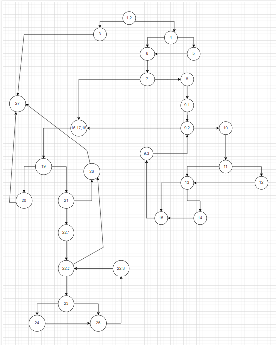

# Marija Dimitrovska 145049
Control Flow Graph
Фотографија од control flow graph-ot именувана cfg.png

TASK 3:
(predikatni jazli 10 ima +1 za kompleksnost = 11 )

M = E - N + 2
M = 11

37врски и 28 јазли.Со тоа имаме 37-28+2=11

TASK 4:
Тест случаи според критериумот Every Branch
1. User null => исполнет е првиот услов TXX
2. User ("ana", "Password123!", "ana@gmail.com") => password има специјален знак и нема празно место
3. User("tom", "Pass", "tom@gmail.com") => user за кој проверуваме дупликат password и email
4. User("tom", "tom", "tom@gmailcom") => user со ист password и username и без точка во username
5. User("eva", "Password123??", "eva@gmail.com") => нов user за кој програмата враќа TRUE

TASK 5:
Test case: Null user
Explanation: In this test case, we pass a null user object. This should trigger the first condition user==null, resulting in the condition evaluating to true. The function should throw a RuntimeException with the message "Mandatory information missing!"

Test case: Null password
Explanation: In this test case, we pass a user object with a null password and non-null email. This should trigger the second condition user.getPassword()==null, resulting in the condition evaluating to true. The function should throw a RuntimeException with the message "Mandatory information missing!"

Test case: Null email
Explanation: In this test case, we pass a user object with a null email and non-null password. This should trigger the third condition user.getEmail()==null, resulting in the condition evaluating to true. The function should throw a RuntimeException with the message "Mandatory information missing!"

Test case: Null password and email
Explanation: In this test case, we pass a user object with both the password and email as null. This should trigger the second and third conditions, resulting in the condition evaluating to true. The function should throw a RuntimeException with the message "Mandatory information missing!"

Test case: Non-null user with valid password and email
Explanation: In this test case, we pass a user object with non-null password and email. This should make all three conditions user==null, user.getPassword()==null, and user.getEmail()==null evaluate to false, and the function should proceed without throwing an exception.